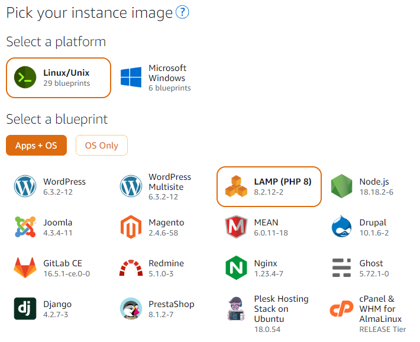
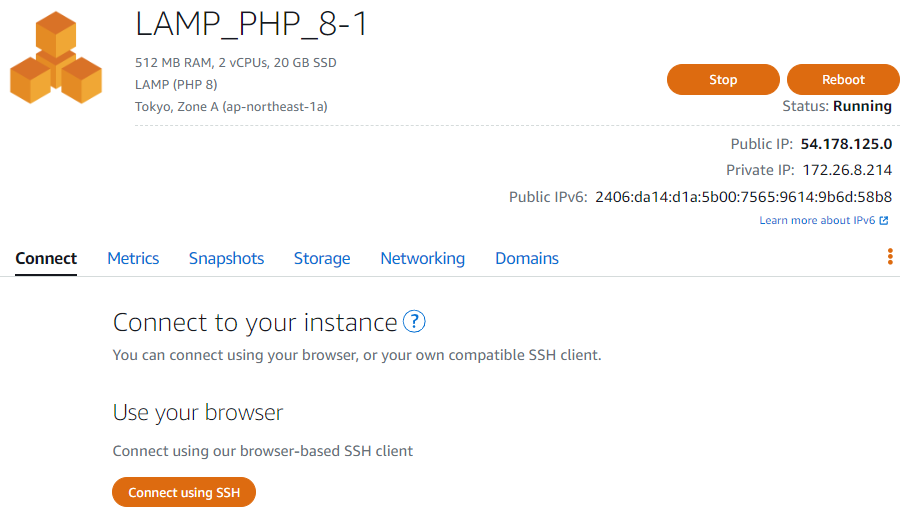
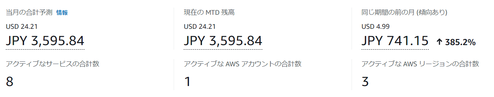

## はじめに
ということで、始まりました！アドベントカレンダー2023！
今年のアドベントカレンダーの運営を行っています、後藤サトシです。

名前のせいで意図せず()マサラキャラが浸透してしまっている今日この頃です。


## 執筆動機
さて、皆さんは最近親しい友人やお世話になった方に年賀状は送られていますか？
やはり印刷や住所整理などの準備は結構大変ですよね

自分は高一まで筆ぐるめ（年賀状が作成できるPCソフト）で作成して
ワクワクしながらプリントアウトして送っていましたが、いつの間にか送らなくなり...

じゃあ、せっかくなので年賀状のように新年のお祝いと日頃の感謝を伝えるようなものを、HTMLで作成して送っちゃおう（？）  
というのが発端です。

学生の頃には大学の友人にHTMLで作成したシンプルすぎるバースデーカードなんかをふざけて送り付けていました。  
[参考](http://awinite.starfree.jp/birthdaycard/syu/)
HPでバースデーカードを贈る意外性でウケは良かったですが  
送る度にindex.htmlをコピペしてメッセージを直書きし  
スターサーバーの無料枠にFFFTPでリリース(？)といったような手段をとっていました。  

毎回ファイルをコピペしてFFFTPでファイル転送するのはさすがに大変。  
ということでうまいこと楽にできないかな～ということで
LaravelとAWSで超！簡単に作ってみようと思い立った今日この頃です。

## 作ったもの
- 名前とメッセージを入力すれば新年を祝うページが作成されるシステム

インフラにAWS Lightsailを利用しました。
- AWS Lightsailの概要
  - AWSが提供しているVPSサービスになります。
  - 基本的にAWSのサービスは機能ごとにサービスが提供されていますが
  このサービスは様々な機能が1つのパッケージとして提供されているものになります。
  - レンタルサーバーを利用するようにWEBサイトやWEBサービスを作ることが出来ます。
長田さんも言及されていますね！
画像
（無許可引用ですすみません）

### 導入手順
- 準備するもの
  - AWSアカウント
  - デプロイしたいLaravelのコード（今回はgithubからクローンしてきます）

1. インスタンスの作成  

- LightsailではこのようにOSとアプリケーションを最初から選択出来ます。
  - 今回はOSをLinux、そして皆さんも恐らく御用達のLAMPを導入していきます。

1. デプロイ  
  
Lightsailの画面上からターミナルを開きます。  

  
ターミナルで下記を実行していきます。
```
// mysqlのパスワードを取得（ここで表示されるパスワードを控えておきます）
cat $HOME/bitnami_application_password
// アプリをインストールするディレクトリへ移動
cd /opt/bitnami/apache2/htdocs/
// gitでソースを持ってくる
git clone 【githubのソースURL】
// 持ってきたソースへ移動
cd 【cloneしたソースのディレクトリ】
// composerをinstall
composer install
```

アプリ用ドキュメントルートの変更
```
vi /opt/bitnami/apache2/conf/bitnami/bitnami.conf
----------------------------
// 該当箇所に【ソースのディレクトリ/public】を2か所追加します。
DocumentRoot "/opt/bitnami/apache2/htdocs/ソースのディレクトリ/public"
<Directory "/opt/bitnami/apache2/htdocs/ソースのディレクトリ/public">
----------------------------
```

```
// Apacheの再起動
sudo /opt/bitnami/ctlscript.sh restart apache
// storageの権限変更
chmod 777 -R storage/
```
DBの作成
```
mysql -u root -p
Enter password:【取得したmysqlのパスワードを入力】
----------------------------
mysql > create database 【Laravelの.env.exampleで設定しているデータベース名】
mysql > exit;
----------------------------
```

envファイルの作成
```
// .env.exampleをコピーして.envファイルを作成
cp .env.example .env
vi .env
----------------------------
DB_CONNECTION=mysql
DB_HOST=localhost
DB_PORT=3306
DB_DATABASE=【任意のデータベース名】
DB_USERNAME=root
DB_PASSWORD=【bitnami_credentialsに書いてあるパスワードを入力】
----------------------------
// キーを作成
php artisan ley:generate
// マイグレーション
php artisan migrate
```
操作としては以上になります。

ということで、公開した年賀状がこちら！
[年賀状的ななにか](http://54.178.125.0/card/1)
あまり見せられる機会もないので
ここぞとばかりに甥っ子を見せびらかしておきます。（姉からの許可承諾済）

イラスト：中学の同級生

## 今後やること
- バースデーカードの実装
- サイト内でのデザイン変更機能など

## 最後に
Lightsailは月額固定制なのでサブスク感覚で利用できますね  
下記のようにAWSの様々なサービスの料金を心配する必要もないです...  

  

機能が１つにまとまっている分、EC2と比べると柔軟性はあまりないですが
Lightsailで構築したものをEC2に移行もできるので
結構使い勝手が良いかもしれません。

ということで、改めてアドベントカレンダー2023開幕です！
クリスマスまでの12/25まで、皆さんの記事を楽しみにお待ちしております！
ここまでご覧いただき誠にありがとうございました！
